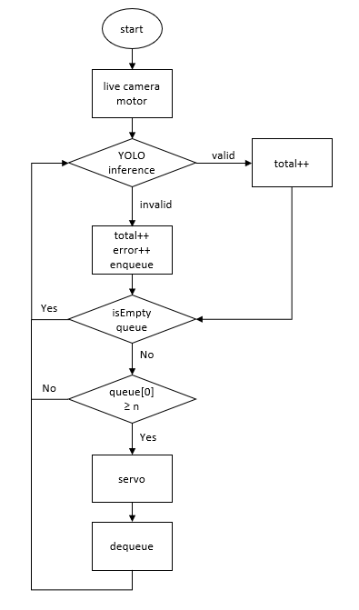
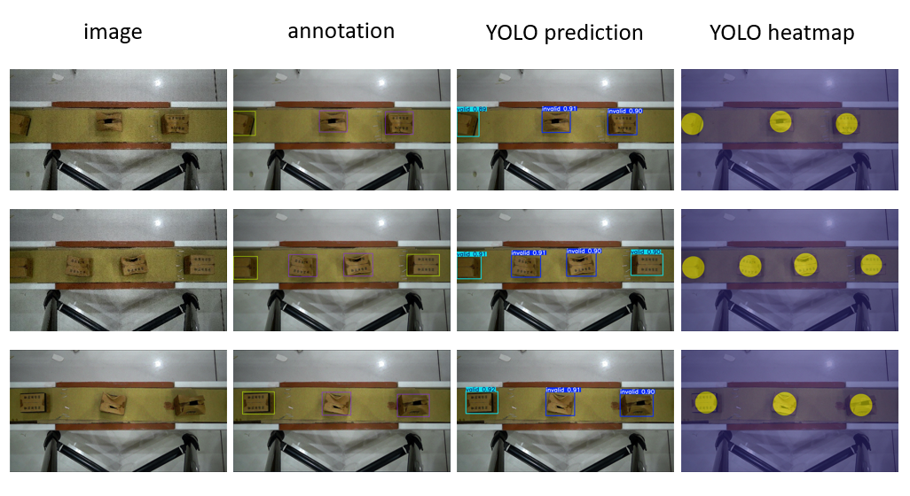
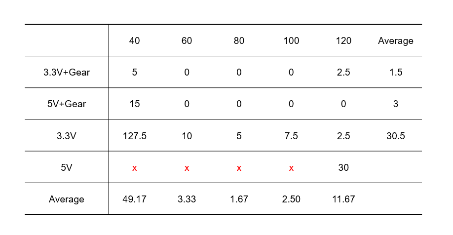
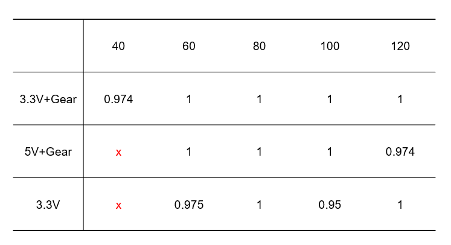
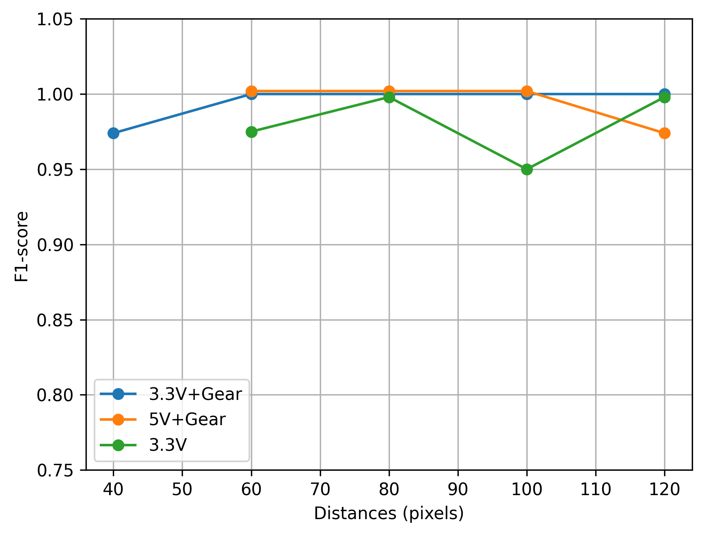

# Hệ thống băng truyền kiểm tra hộp carton

## 1. Giới thiệu

Hệ thống này dùng **camera + YOLO** để kiểm tra hộp carton trên băng truyền, phân loại thành:

- `valid` – sản phẩm đạt  
- `invalid` – sản phẩm lỗi (bị loại)

Kết quả được:

- Ghi log vào **MySQL**
- Hiển thị trên **giao diện Tkinter + ttkbootstrap**
- Điều khiển **servo/bộ gạt** qua vi điều khiển (ATmega16) để đẩy hộp lỗi ra khỏi băng.

Hệ thống cũng hỗ trợ **thực nghiệm** để khảo sát ảnh hưởng của:

- Tốc độ băng truyền  
- Tham số tracking: `MAX_DISTANCE`, `MAX_DISAPPEARED`  

đến độ chính xác của toàn hệ thống.

---

## 2. Chức năng chính

- Nhận dạng real-time bằng YOLO (`valid` / `invalid`)
- Tracking hộp theo thời gian (gán `track_id`)
- Tự động loại hộp lỗi bằng servo/bộ gạt
- Ghi log vào MySQL:
  - Bảng `errors(id, error_type, timestamp)`
- Giao diện 3 tab:
  - **Monitor**: camera, counters, log, nút Start/Stop
  - **Database**: xem log theo ngày/tháng/năm/khoảng, export CSV
  - **Statistics**: vẽ biểu đồ số lượng hộp theo thời gian

---

## 3. Kiến trúc tổng quát

### Phần cứng

- Camera quan sát vùng băng truyền
- Băng truyền + motor (nhiều mức tốc độ)
- Vi điều khiển (ATmega16) - cần có `Atmel studio` và tải file `servo_test_barebone.rar` để nạp code atmega:
  - Nhận lệnh từ PC qua UART
  - Điều khiển servo/bộ gạt và băng truyền
- PC chạy Python (xử lý, giao diện, DB)

### Phần mềm

- **YOLOProcessor**:  
  - Mở camera, chạy YOLO, sinh bounding box + class
  - Dùng `SimpleCentroidTracker` để tracking
- **SimpleCentroidTracker**:
  - Tham số:
    - `MAX_DISTANCE`: ngưỡng ghép detection vào track cũ
    - `MAX_DISAPPEARED`: số frame cho phép mất dấu
- **ActuatorController**:
  - Nhận hộp lỗi, chờ đến vị trí loại bỏ, điều khiển servo/pump
- **DatabaseManager**:
  - Tự tạo DB `conveyor_db` và bảng `errors`
  - Hàm `log_error(...)`, `fetch_errors_*`, `get_today_counters()`
- **ConveyorApp (Tkinter)**:
  - Giao diện 3 tab, cập nhật frame camera, counters và biểu đồ



---

## 4. Kết quả

<p align="center">
  
</p>

<p align="center">
  <em>Hình 1. Kết quả nhận diện của YOLO</em>
</p>

<p align="center">
  
</p>

<p align="center">
  <em>Hình 2. Overcount rate (%) ở mỗi cấu hình tham số</em>
</p>

Sử dụng tỷ lệ đếm dư (overcount rate) để đánh giá độ ổn định của hệ thống trong bài toán đếm sản phẩm trên băng truyền. Chỉ số này phản ánh mức chênh lệch giữa số sản phẩm hệ thống ghi nhận và số sản phẩm thực tế, được tính theo công thức

Overcount rate = (N_count​−40​)/40

Trong đó, 𝑁_count là số sản phẩm được hệ thống ghi nhận. Các cấu hình có tỷ lệ đếm dư vượt quá 10% sẽ bị loại bỏ nhằm đảm bảo độ tin cậy và khả năng ứng dụng của hệ thống trong điều kiện vận hành thực tế.

<p align="center">
  
</p>

<p align="center">
  <em>Hình 3. F1-score với mỗi cấu hình tham số được chọn</em>
</p>

<p align="center">
  
</p>

<p align="center">
  <em>Hình 4. Biểu đồ F1-score theo từng mức điện áp đầu vào</em>
</p>

Dựa trên kết quả phân tích, bộ tham số đầu vào tối ưu được lựa chọn là (3.3V+gear & 80 pixel), bộ tham số này thỏa mãn đồng thời hai tiêu chí (1) tỷ lệ đếm dư nằm dưới ngưỡng cho phép và (2) đạt giá trị F1-score cao nhất hoặc tiệm cận cao nhất trong các cấu hình được khảo sát.

## 5. Yêu cầu & cài đặt

### Yêu cầu

- Python 3.10+ (Windows 10/11)
- MySQL Server (ví dụ 8.0)
- Các thư viện chính:
  - `opencv-python`
  - `ultralytics`
  - `ttkbootstrap`
  - `mysql-connector-python`
  - `Pillow`
  - `matplotlib`
  - `numpy`
  - `pyserial`

### Cài đặt

```bash
git clone <link-repo>
cd <folder-project>
python -m venv venv
venv\Scripts\activate
pip install -r requirements.txt
