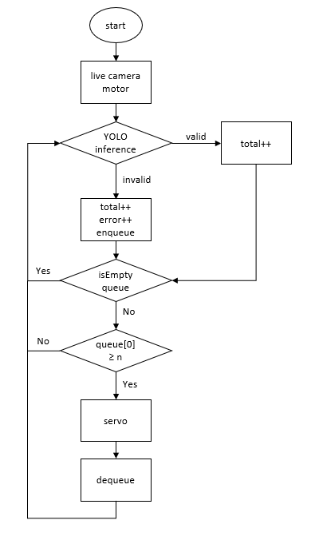
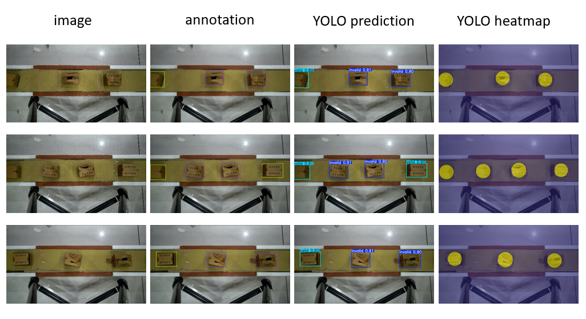
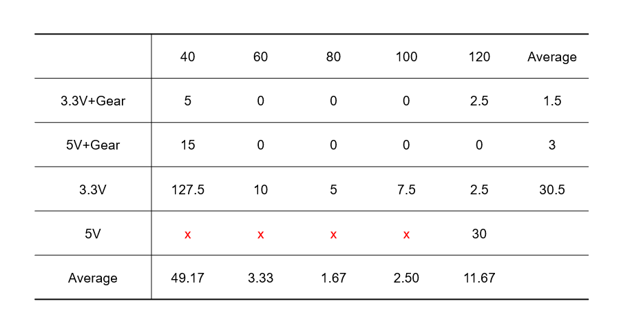
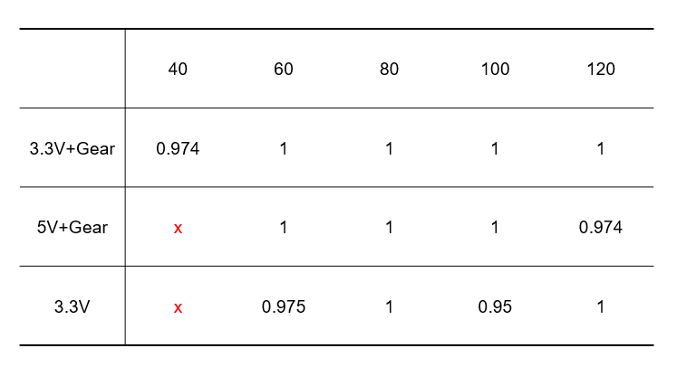
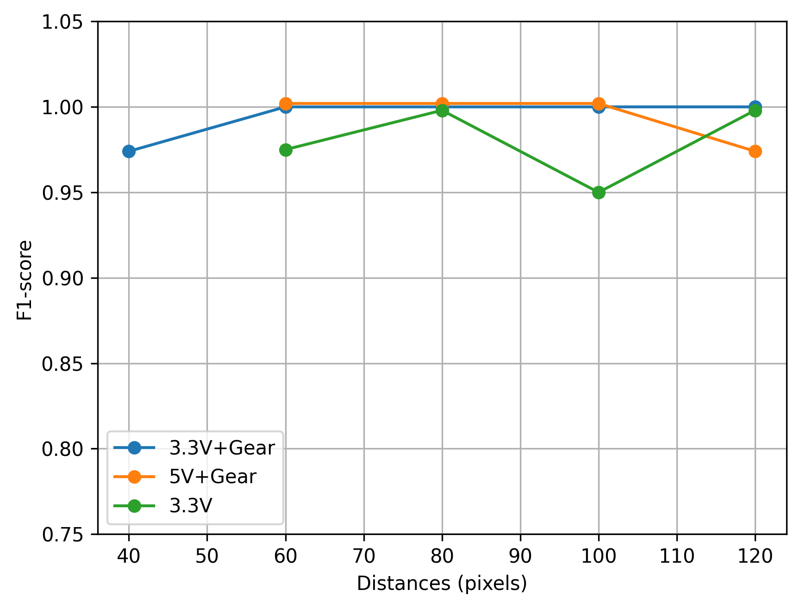

<!-- # Hệ thống băng truyền kiểm tra hộp carton

## 1. Giới thiệu

Hệ thống này dùng **camera + YOLO** để kiểm tra hộp carton trên băng truyền, phân loại thành:

- `valid` – sản phẩm đạt  
- `invalid` – sản phẩm lỗi (bị loại)

Kết quả được:

- Ghi log vào **MySQL**
- Hiển thị trên **giao diện Tkinter + ttkbootstrap**
- Điều khiển **servo/bộ gạt** qua vi điều khiển (ATmega16) để đẩy hộp lỗi ra khỏi băng.

Hệ thống cũng hỗ trợ **thực nghiệm** để khảo sát ảnh hưởng của:

- Tốc độ băng truyền  
- Tham số tracking: `MAX_DISTANCE`, `MAX_DISAPPEARED`  

đến độ chính xác của toàn hệ thống.

---

## 2. Chức năng chính

- Nhận dạng real-time bằng YOLO (`valid` / `invalid`)
- Tracking hộp theo thời gian (gán `track_id`)
- Tự động loại hộp lỗi bằng servo/bộ gạt
- Ghi log vào MySQL:
  - Bảng `errors(id, error_type, timestamp)`
- Giao diện 3 tab:
  - **Monitor**: camera, counters, log, nút Start/Stop
  - **Database**: xem log theo ngày/tháng/năm/khoảng, export CSV
  - **Statistics**: vẽ biểu đồ số lượng hộp theo thời gian

---

## 3. Kiến trúc tổng quát

### Phần cứng

- Camera quan sát vùng băng truyền
- Băng truyền + motor (nhiều mức tốc độ)
- Vi điều khiển (ATmega16) - cần có `Atmel studio` và tải file `servo_test_barebone.rar` để nạp code atmega:
  - Nhận lệnh từ PC qua UART
  - Điều khiển servo/bộ gạt và băng truyền
- PC chạy Python (xử lý, giao diện, DB)
- Mạch PCB điều khiển cơ cấu chấp hành gồm động cơ, server qua ATmega16 và UART được thiết kế bằng Altium.

### Phần mềm

- **YOLOProcessor**:  
  - Mở camera, chạy YOLO, sinh bounding box + class
  - Dùng `SimpleCentroidTracker` để tracking
- **SimpleCentroidTracker**:
  - Tham số:
    - `MAX_DISTANCE`: ngưỡng ghép detection vào track cũ
    - `MAX_DISAPPEARED`: số frame cho phép mất dấu
- **ActuatorController**:
  - Nhận hộp lỗi, chờ đến vị trí loại bỏ, điều khiển servo/pump
- **DatabaseManager**:
  - Tự tạo DB `conveyor_db` và bảng `errors`
  - Hàm `log_error(...)`, `fetch_errors_*`, `get_today_counters()`
- **ConveyorApp (Tkinter)**:
  - Giao diện 3 tab, cập nhật frame camera, counters và biểu đồ



---

## 4. Kết quả

<p align="center">
  
</p>

<p align="center">
  <em>Hình 1. Kết quả nhận diện của YOLO</em>
</p>

<p align="center">
  
</p>

<p align="center">
  <em>Hình 2. Overcount rate (%) ở mỗi cấu hình tham số</em>
</p>

Sử dụng tỷ lệ đếm dư (overcount rate) để đánh giá độ ổn định của hệ thống trong bài toán đếm sản phẩm trên băng truyền. Chỉ số này phản ánh mức chênh lệch giữa số sản phẩm hệ thống ghi nhận và số sản phẩm thực tế, được tính theo công thức

Overcount rate = (N_count​−40​)/40

Trong đó, 𝑁_count là số sản phẩm được hệ thống ghi nhận. Các cấu hình có tỷ lệ đếm dư vượt quá 10% sẽ bị loại bỏ nhằm đảm bảo độ tin cậy và khả năng ứng dụng của hệ thống trong điều kiện vận hành thực tế.

<p align="center">
  
</p>

<p align="center">
  <em>Hình 3. F1-score với mỗi cấu hình tham số được chọn</em>
</p>

<p align="center">
  
</p>

<p align="center">
  <em>Hình 4. Biểu đồ F1-score theo từng mức điện áp đầu vào</em>
</p>

Dựa trên kết quả phân tích, bộ tham số đầu vào tối ưu được lựa chọn là (3.3V+gear & 80 pixel), bộ tham số này thỏa mãn đồng thời hai tiêu chí (1) tỷ lệ đếm dư nằm dưới ngưỡng cho phép và (2) đạt giá trị F1-score cao nhất hoặc tiệm cận cao nhất trong các cấu hình được khảo sát.

## 5. Yêu cầu & cài đặt

### Yêu cầu

- Python 3.10+ (Windows 10/11)
- MySQL Server (ví dụ 8.0)
- Các thư viện chính:
  - `opencv-python`
  - `ultralytics`
  - `ttkbootstrap`
  - `mysql-connector-python`
  - `Pillow`
  - `matplotlib`
  - `numpy`
  - `pyserial`

### Cài đặt

```bash
git clone <link-repo>
cd <folder-project>
python -m venv venv
venv\Scripts\activate
pip install -r requirements.txt -->


# Carton Box Inspection Conveyor System

## 1. Introduction

This system uses a **camera + YOLO** to inspect carton boxes on a conveyor belt and classify them into two categories:

- `valid` – accepted product  
- `invalid` – defective product (to be rejected)

The system can:

- Log inspection results to **MySQL**
- Display information through a **Tkinter + ttkbootstrap** interface
- Control a **servo/pusher mechanism** via a microcontroller (**ATmega16**) to remove defective boxes from the conveyor belt

The system also supports **experimental evaluation** to analyze the effects of:

- Conveyor speed
- Tracking parameters: `MAX_DISTANCE`, `MAX_DISAPPEARED`

on the overall system accuracy.

---

## 2. Main Features

- Real-time detection using YOLO (`valid` / `invalid`)
- Object tracking over time using `track_id`
- Automatic rejection of defective boxes using a servo/pusher
- Logging to MySQL:
  - Table: `errors(id, error_type, timestamp)`
- A 3-tab graphical user interface:
  - **Monitor**: camera view, counters, logs, Start/Stop buttons
  - **Database**: view logs by day/month/year/custom range, export CSV
  - **Statistics**: visualize box counts over time using charts

---

## 3. System Architecture

### Hardware

- Camera monitoring the conveyor area
- Conveyor belt + motor with multiple speed levels
- Microcontroller (**ATmega16**)
  - Receives commands from the PC via UART
  - Controls the servo/pusher and conveyor operation
  - Requires **Atmel Studio** and the file `servo_test_barebone.rar` to program the ATmega16
- PC running Python for image processing, GUI, and database operations
- A PCB for actuator control, including the motor and servo driven by the ATmega16 via UART, designed in **Altium**


### Software

- **YOLOProcessor**
  - Opens the camera
  - Runs YOLO inference
  - Produces bounding boxes and class labels
  - Uses `SimpleCentroidTracker` for tracking

- **SimpleCentroidTracker**
  - Main parameters:
    - `MAX_DISTANCE`: threshold for associating a new detection with an existing track
    - `MAX_DISAPPEARED`: maximum number of frames an object can disappear before being removed

- **ActuatorController**
  - Receives defective box events
  - Waits until the box reaches the rejection position
  - Triggers the servo/pusher

- **DatabaseManager**
  - Automatically creates the database `conveyor_db` and the table `errors`
  - Provides functions such as `log_error(...)`, `fetch_errors_*`, and `get_today_counters()`

- **ConveyorApp (Tkinter)**
  - Provides a 3-tab interface
  - Updates the live camera feed, counters, and statistical charts

<!--  -->

<p align="center">
  
</p>

<p align="center">
  <em>System Flowchart</em>
</p>

---

## 4. Results

<p align="center">
  
</p>

<p align="center">
  <em>Figure 1. YOLO detection results</em>
</p>

<p align="center">
  
</p>

<p align="center">
  <em>Figure 2. Overcount rate (%) for each parameter configuration</em>
</p>

The **overcount rate** was used to evaluate the stability of the system in the conveyor-based product counting task. This metric reflects the difference between the number of products counted by the system and the actual number of products, and is defined as:

\[
\text{Overcount rate} = \frac{N_{count} - 40}{40}
\]

where \(N_{count}\) is the number of products counted by the system.

Configurations with an overcount rate greater than **10%** were excluded to ensure the reliability and practical applicability of the system under real operating conditions.

<p align="center">
  
</p>

<p align="center">
  <em>Figure 3. F1-score for each selected parameter configuration</em>
</p>

<p align="center">
  
</p>

<p align="center">
  <em>Figure 4. F1-score comparison across input voltage levels</em>
</p>

Based on the analysis results, the optimal input parameter configuration was selected as **(3.3V + gear & 80 pixels)**. This configuration satisfies both criteria:

1. The overcount rate remains below the acceptable threshold  
2. The F1-score is the highest, or close to the highest, among the tested configurations

---

## 5. Requirements and Installation

### Requirements

- Python 3.10+ (Windows 10/11)
- MySQL Server (for example, version 8.0)
- Main libraries:
  - `opencv-python`
  - `ultralytics`
  - `ttkbootstrap`
  - `mysql-connector-python`
  - `Pillow`
  - `matplotlib`
  - `numpy`
  - `pyserial`

### Installation

```bash
git clone <repository-link>
cd <project-folder>
python -m venv venv
venv\Scripts\activate
pip install -r requirements.txt